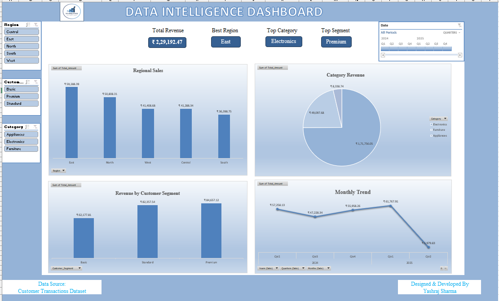

# 📊 Data Intelligence Dashboard

An advanced Microsoft Excel dashboard project designed for customer transaction analysis, KPI monitoring, revenue tracking, and business intelligence reporting.

## 📌 About This Project

This repository contains an interactive Excel dashboard that provides insights into:

- Revenue performance analysis
- Regional sales tracking
- Customer segmentation analysis
- Product category performance
- Monthly revenue trends
- Interactive business intelligence reporting

## 📂 Files Included

- `Excel_PR.Final_Project.xlsx` → Main Excel Dashboard
- `Excel_PR.Final_Project.png` → Dashboard Output Screenshot

## 🛠 Technologies Used

- Microsoft Excel
- Pivot Tables
- Pivot Charts
- Slicers
- KPI Cards
- Data Visualization
- Business Intelligence Techniques

## 🎯 Dashboard Features

### KPI Section
- Total Revenue
- Best Region
- Top Category
- Top Customer Segment

### Analysis Reports
- Regional Revenue Analysis
- Category Revenue Distribution
- Customer Segment Analysis
- Monthly Revenue Trend

### Interactive Filters
- Region Filter
- Customer Segment Filter
- Category Filter
- Date Timeline Filter

## 📈 Key Insights

- East region generated the highest revenue.
- Electronics emerged as the top-performing category.
- Premium customers contributed the highest revenue.
- Interactive slicers provide dynamic data exploration.

## 📸 Dashboard Preview

## 🎓 Learning Outcomes

This project helps in understanding:

- Excel Dashboard Development
- Business Intelligence Reporting
- KPI Monitoring
- Customer Analytics
- Revenue Analysis
- Interactive Data Visualization
- Data-driven Decision Making

## 👨‍💻 Author

**Yashraj Sharma**

---

⭐ If you like this project, don't forget to star the repository.
